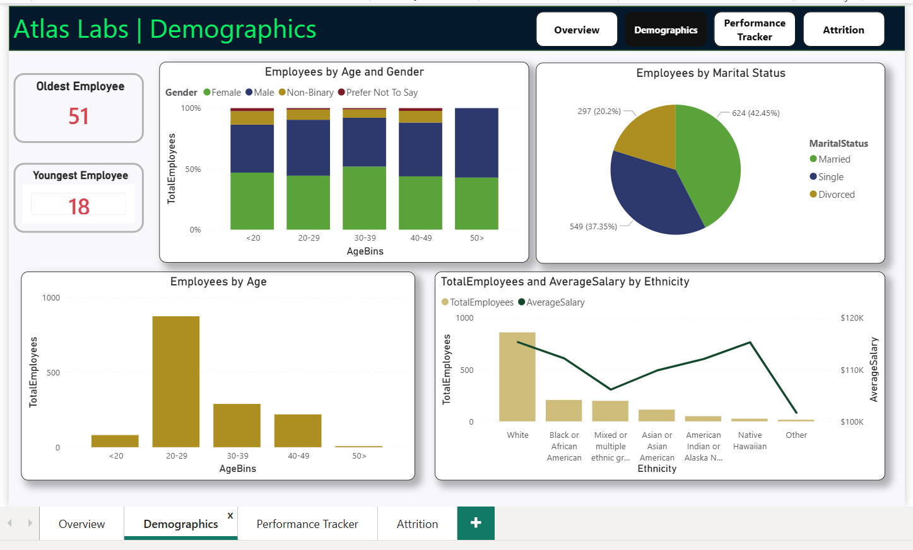
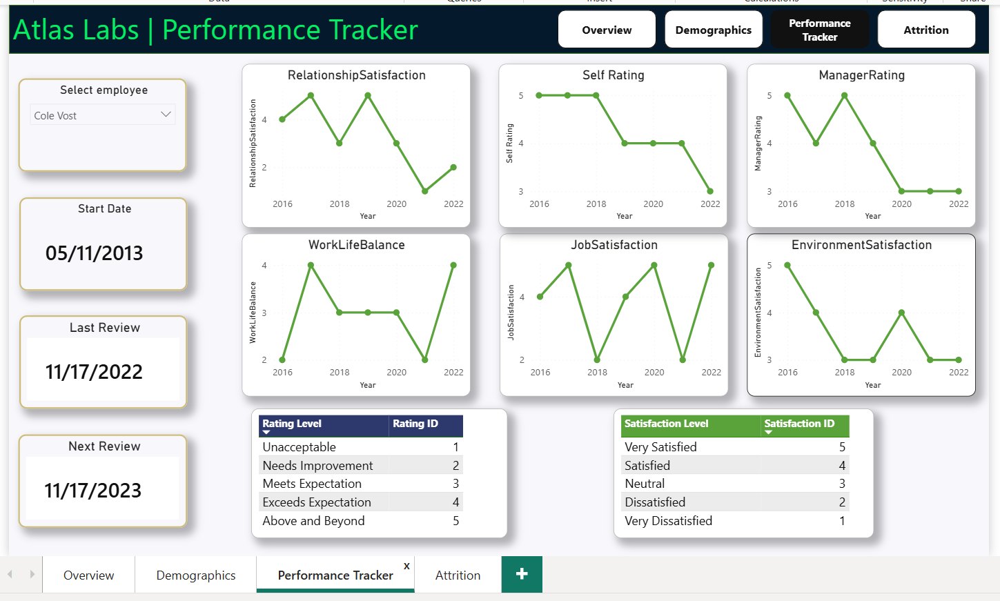
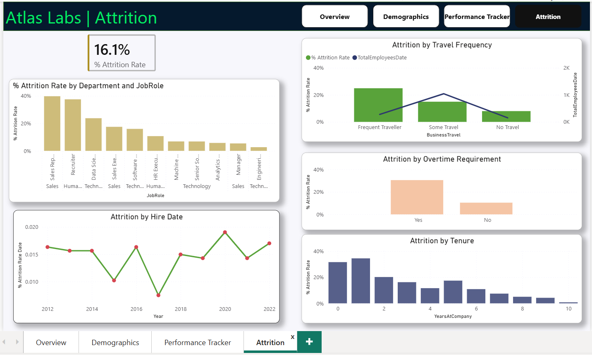

# 👥 Atlas Labs HR Analytics Dashboard

## Project Overview

This project analyzes workforce and employee attrition data for Atlas Labs. The objective is to identify workforce trends, understand employee turnover, and provide insights that support employee retention strategies.

---

## Business Problem

Atlas Labs wanted to understand:

- Workforce composition
- Employee demographics
- Performance trends
- Attrition drivers
- Retention opportunities

---

## Tools & Technologies

- Power BI
- DAX
- Power Query
- Data Modeling
- HR Analytics

---

## Dashboard Pages

### 1. Overview

Provides a summary of:

- Total Employees
- Active Employees
- Inactive Employees
- Attrition Rate
- Department Distribution

---

### 2. Demographics

Analyzes:

- Age Distribution
- Gender Distribution
- Marital Status
- Education Levels

---

### 3. Performance Tracker

Evaluates:

- Employee Performance Ratings
- Department Performance
- Job Role Analysis

---

### 4. Attrition Analysis

Investigates:

- Attrition by Department
- Attrition by Job Role
- Employee Retention Patterns
- Key Attrition Drivers

---

## Key Insights

- Total workforce consists of 1,470 employees.
- Attrition rate stands at 16.1%.
- Technology department has the largest workforce.
- Attrition varies significantly across departments and job roles.
- Workforce demographics reveal opportunities for targeted retention programs.

---

## Business Recommendations

- Focus retention initiatives on high-attrition departments.
- Strengthen employee engagement programs.
- Develop targeted career development plans.
- Monitor workforce trends through ongoing reporting.

---

## Author

Vidhya Rasu
🔗 LinkedIn: https://www.linkedin.com/in/vidhya-rasu-74a9b31a5 
