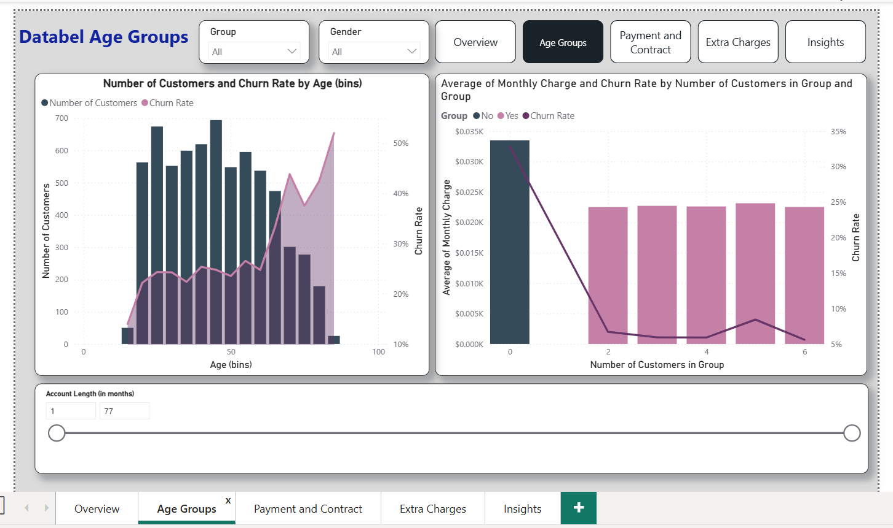
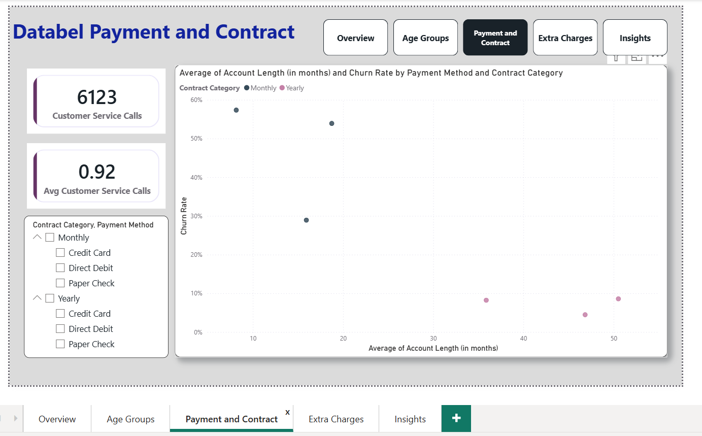
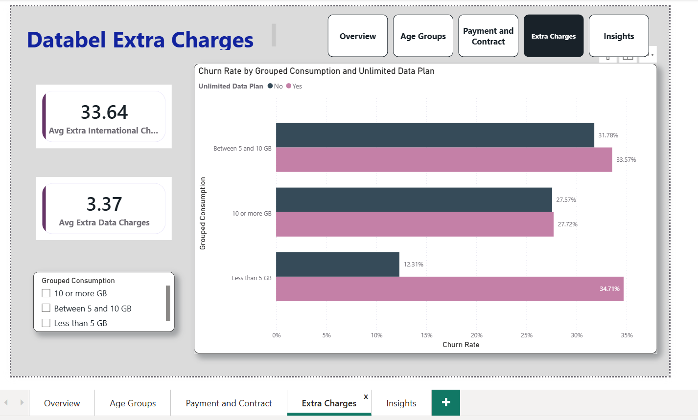
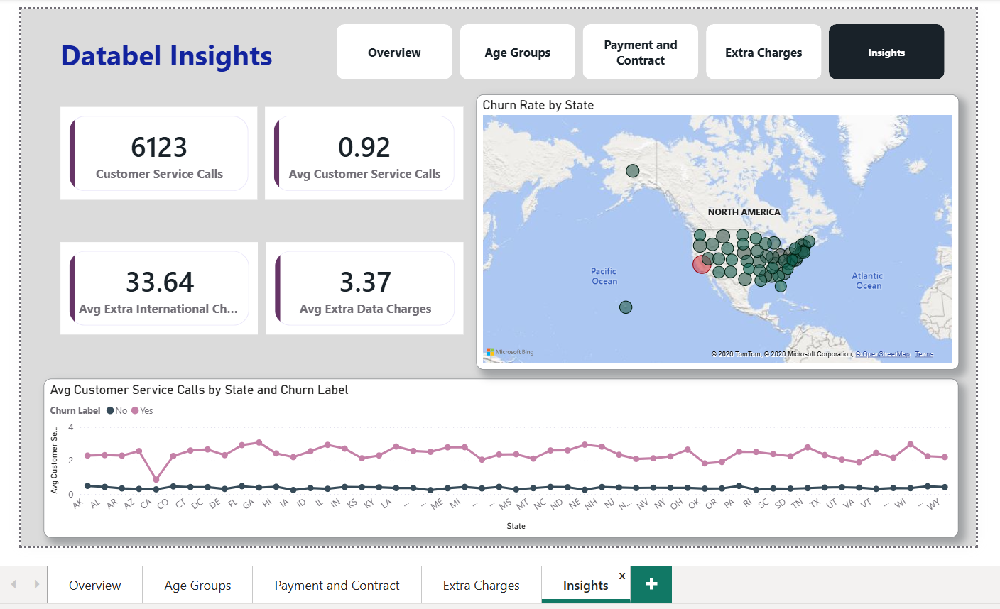

# 📊 Databel Customer Churn Analysis

## Project Overview

Customer churn is one of the most critical challenges faced by subscription-based businesses. This project analyzes customer churn patterns for Databel, a telecom company, to identify key drivers of customer attrition and provide actionable recommendations for improving retention.

---

## Business Problem

Databel experienced a significant number of customers leaving its services. The goal was to:

- Measure overall churn rate
- Identify customer segments with higher churn
- Understand churn reasons and categories
- Analyze demographic and behavioral patterns
- Recommend strategies to reduce customer attrition

---

## Tools & Technologies

- Power BI
- DAX
- Power Query
- Data Modeling
- Data Visualization

---

## Dashboard Pages

### 1. Overview
Provides a high-level summary of:
- Total Customers
- Churned Customers
- Churn Rate
- Churn Reasons
- Churn Categories
- Geographic Churn Distribution

---

### 2. Age Group Analysis

Analyzes churn behavior across different customer age groups.

---

### 3. Payment & Contract Analysis

Investigates:
- Contract Types
- Payment Methods
- Their impact on customer retention

---

### 4. Extra Charges Analysis

Explores:
- Additional Fees
- International Charges
- Service-related costs

---

### 5. Insights & Recommendations

Summarizes key findings and business recommendations.

---

## Key Insights

- Overall churn rate was 26.86%.
- Competitor offers were the primary churn driver.
- Customers on month-to-month contracts churned more frequently.
- Certain age groups demonstrated higher churn tendencies.
- Additional service charges influenced customer dissatisfaction.

---

## Business Recommendations

- Introduce loyalty programs for high-risk customers.
- Encourage long-term contract adoption.
- Review pricing strategy against competitors.
- Improve customer support and service quality.

---

## Author

Vidhya Rasu

🔗 LinkedIn: https://www.linkedin.com/in/vidhya-rasu-74a9b31a5 
