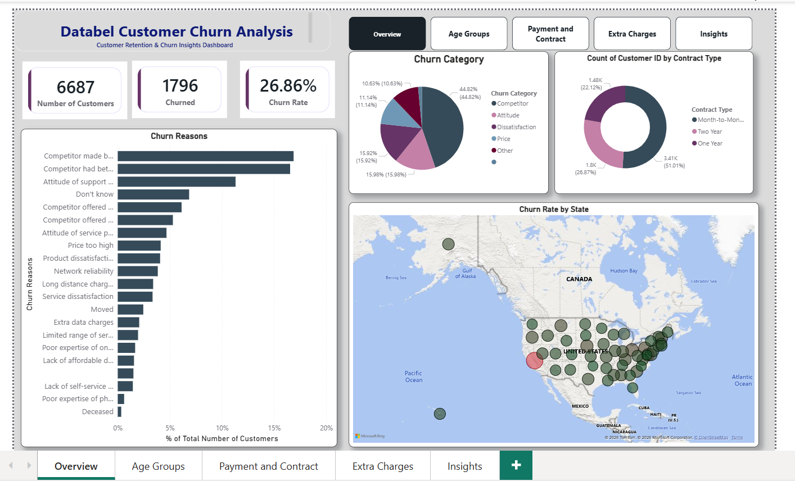
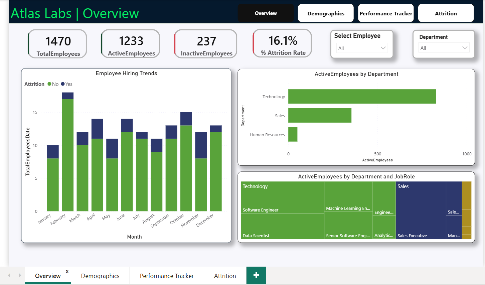

# 📊 Power BI Portfolio

This portfolio showcases end-to-end business intelligence projects focused on customer analytics and workforce analytics. These projects demonstrate my skills in data modeling, DAX, Power Query, dashboard design, and business storytelling using Power BI.

---

## 🚀 Projects

### 📊 Databel Customer Churn Analysis

A customer retention analysis project for a telecom company aimed at identifying churn drivers, understanding customer behavior, and recommending strategies to improve retention.

**Skills Applied**

* Power BI
* DAX
* Power Query
* Data Modeling
* Customer Analytics
* Data Visualization

---

### 👥 Atlas Labs HR Analytics Dashboard

An HR analytics project focused on workforce demographics, employee performance, and attrition analysis to support data-driven HR decision-making.

**Skills Applied**

* Power BI
* DAX
* Power Query
* Data Modeling
* HR Analytics
* Dashboard Design

---

## 🛠 Technologies & Skills

* Power BI
* DAX
* Power Query
* Data Modeling
* Data Visualization
* Dashboard Design
* Business Intelligence
* Customer Analytics
* HR Analytics
* KPI Development

---

## 👤 Author

**Vidhya Rasu**

🔗 LinkedIn: https://www.linkedin.com/in/vidhya-rasu-74a9b31a5 

🔗 GitHub: https://github.com/vrasup
